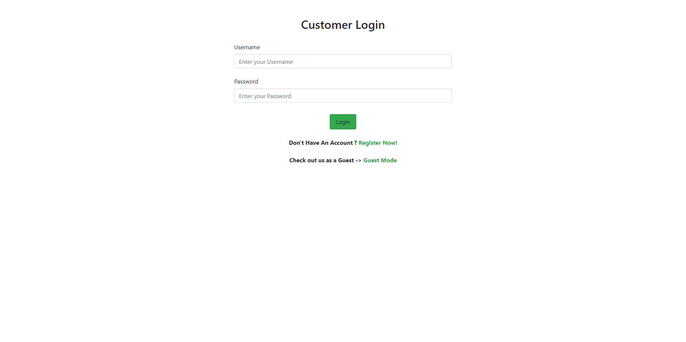
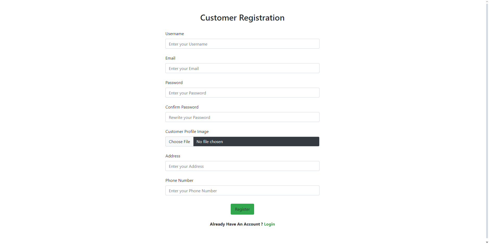
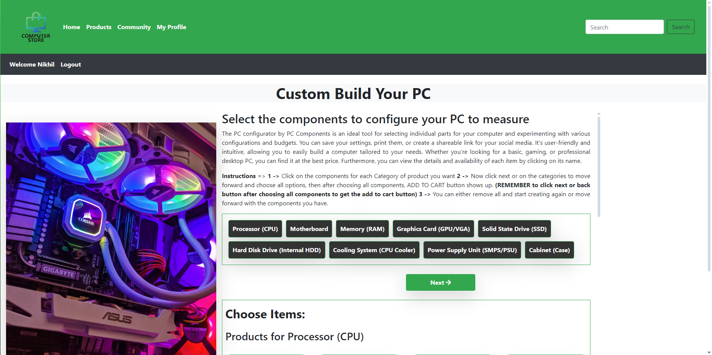
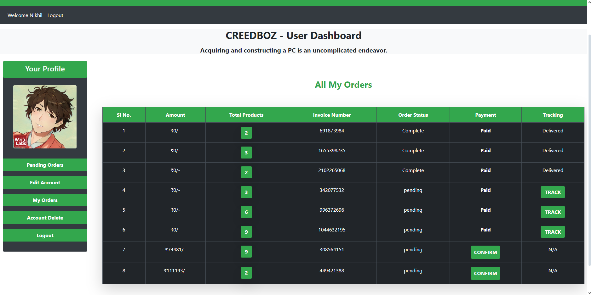

# 🛒 Ecommerce Website – Computer Accessories Store

A dynamic **E-commerce website for computer accessories** that allows users to browse products, add items to cart, build custom PC configurations, and interact with other users through a community chat feature.

🔗 **Repository:** [GitHub Link](https://github.com/Tarun-Kannadas/Ecommerce-Website)

---

## 📌 Features

- 🖥️ Browse a wide range of computer accessories  
- 🛒 Add, remove, and manage items in the cart  
- 🛠️ **Build Your PC** feature for custom configurations  
- 💬 Community chat for user interaction  
- 🔐 User authentication and registration  
- 📱 Responsive layout for different screen sizes  

---

## 🧱 Tech Stack

- **Frontend:** HTML, CSS  
- **Backend:** PHP  
- **Scripting:** JavaScript  
- **Server:** Apache (XAMPP / WAMP recommended)  
- **Database:** MySQL *(if configured)*  

---

## 📸 Screenshots

### Home Page


### Customer Login


### Register


### Profile Page


### Product Listing / Logged-in Home Page


### Build Your PC


### Community Chat


### Admin Panel


---

## 📂 Project Structure

```
Ecommerce-Website/
│
├── admin_area/          # Admin-related files
├── users_area/          # User-related pages
├── functions/           # PHP helper functions
├── includes/            # Common components (header, footer)
├── assets/              # CSS, JS, images
│
├── index.php            # Main landing page
├── cart.php             # Shopping cart
├── build_pc.php         # PC builder feature
├── chatbox.php          # Community chat
└── README.md
```

---

## 🚀 Getting Started

Follow the steps below to run the project locally.

### Prerequisites

* XAMPP / WAMP / MAMP
* PHP 7.x or higher
* Web browser (Chrome, Firefox, etc.)

---

## 🛠️ Installation

1. **Clone the repository**

   ```bash
   git clone https://github.com/Tarun-Kannadas/Ecommerce-Website.git
   ```

2. **Move the project**

   * Copy the project folder into `htdocs` (XAMPP) or `www` (WAMP)

3. **Start the server**

   * Run Apache (and MySQL if database is used)

4. **Open in browser**

   ```
   http://localhost/Ecommerce-Website/
   ```

---

## 📦 Usage

* Browse available computer accessories
* Add products to the cart
* Build a custom PC setup
* Chat with other users in the community section

---

## 🙌 Contributing

Contributions are welcome!

1. Fork this repository
2. Create a new branch
3. Commit your changes
4. Push to your branch
5. Open a Pull Request

---

## 📜 License

This project is open for learning and personal use.
You may add a license file if needed (e.g., MIT License).

---

## 👤 Author

**Tarun Kannadas**

* GitHub: [https://github.com/Tarun-Kannadas](https://github.com/Tarun-Kannadas)

---

⭐ If you like this project, don’t forget to star the repository!
